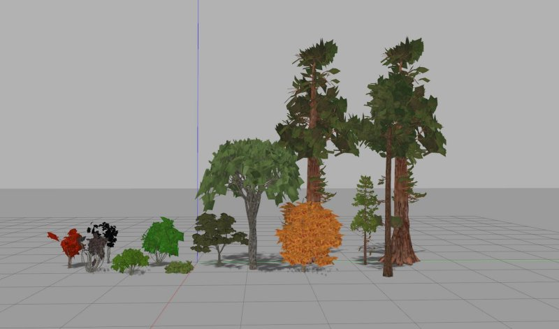

Gazebo Vegetation
========================

This is a ROS package with models of different trees and bushes which you can use for your Gazebo world. Source of meshes is free3d.com .

Installation
-------------------------
Copy the package into your catkin workspace. Run catkin_make. Once you run Gazebo you will see the package in the Insert tab -- you can add the trees and bushes.

Changelog
-----------------
## 0.1
* Added 10 trees and 5 bushes
